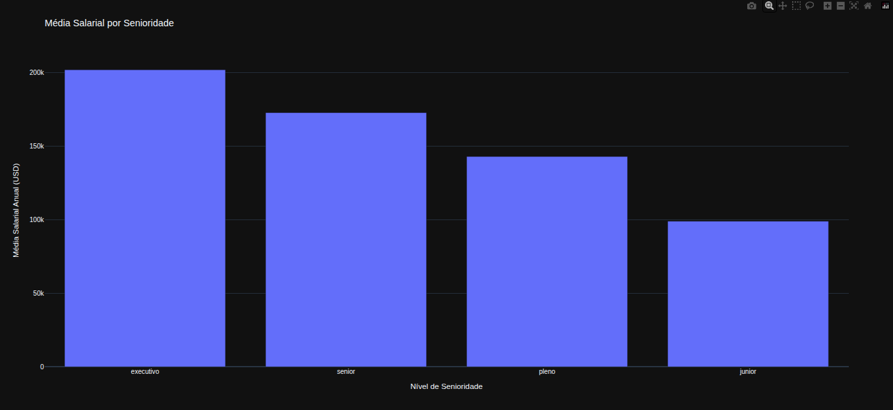
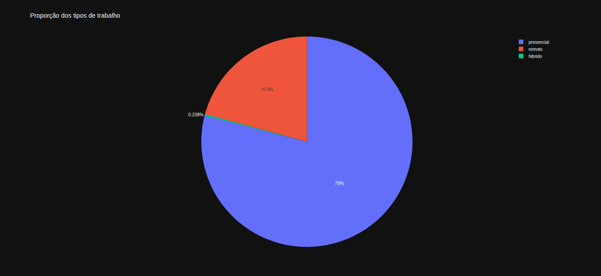
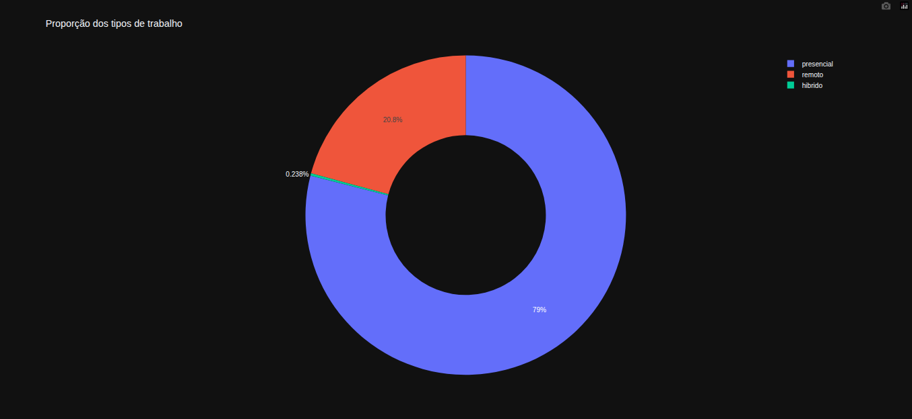
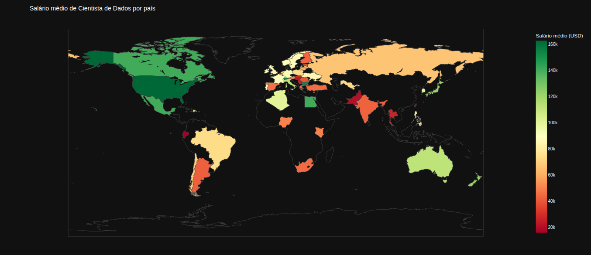

# Imersão Alura Dados Com Python

---

## Repositório para salvar exercícios realizados durante o evento de imersão da [Alura](https://cursos.alura.com.br/imersoes).

---

### Aula 1

> Objetivo: Entender a estrutura da base de dados e realizar uma análise exploratória inicial

Com isso responder algumas perguntas como:

- Qual o nível de experiência mais comum na base de dados? (Senior)
- Qual é o tipo de contrato mais frequente? (Full-time)
- Qual o cargo mais frequente na amostra? (Software Engineer)
- De qual país são a maioria dos profissionais da base? (US)
- Qual é o país onde mais empresas da amostra estão sediadas? (US)
- Qual o regime de trabalho mais comum? (Presencial)
- Qual é o tamanho mais comum das empresas na amostra? (Médio)
- Qual é a faixa salarial mais comum na amostra? (min 15157, max 800000, mean 156492)
- Qual é a moeda mais comum na amostra? (USD)

Entre outras análises mais profundas, facilitando a visualização de padrões e tendências no mercado de trabalho em ciência de dados.

---

### Aula 2
> Objetivo: Preparação e limpeza dos Dados

As técnicas de limpeza e preparação de dados são essenciais para garantir a qualidade e a confiabilidade das análises subsequentes. 

Durante esta aula, foram aplicadas as seguintes técnicas de limpeza e preparação de dados:
- Verificação de nulos: isnull(), isnull().sum(), e seleção de linhas com df[df.isnull().any(axis=1)]
- Remoção de linhas com nulos via dropna()
- Conversão de tipos com assign(astype()) (ex: ano para inteiro)

Além disso, foram exploradas outras técnicas específicas de tratamento de valores ausentes (NaN) em diferentes DataFrames:

#### df-cidades
- Preenchimento de NaN com valor constante usando fillna("Não informado") em nova coluna (cidade_preenchida)
  
#### df-salarios
- Substituição de NaN pela média
- Substituição de NaN pela mediana

#### df-temperaturas
- Preenchimento sequencial para frente (ffill)
- Preenchimento sequencial para trás (bfill)

---

### Aula 3

> Objetivo: Realizar análises mais avançadas e visualizações de dados para extrair insights mais profundos

Nesta aula, foram trabalhados os seguintes tópicos:
- Importação e uso das bibliotecas: pandas, matplotlib.pyplot, seaborn, plotly.express, pycountry
- Análise exploratória (visualizações estáticas com Matplotlib/Seaborn):
  - Gráfico de barras da distribuição de senioridade
  - Barplots da média salarial por senioridade (com ordem personalizada)
  - Histograma e boxplots (incluindo boxplot por senioridade com paleta de cores)
- Visualizações interativas (com Plotly):
  - Barra da média salarial por senioridade
  
  - Gráficos de pizza/donut para proporção de tipos de trabalho
  
  
  - Mapa coroplético da média salarial de Data Scientists por país
  
- Implementado a possibilidade de salvamento do DataFrame limpo em arquivo csv
